## Course API
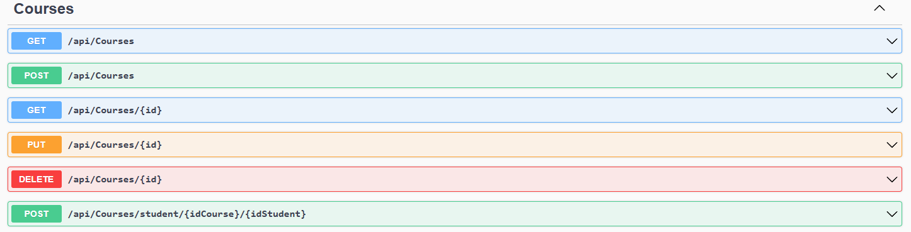
### 1 get all
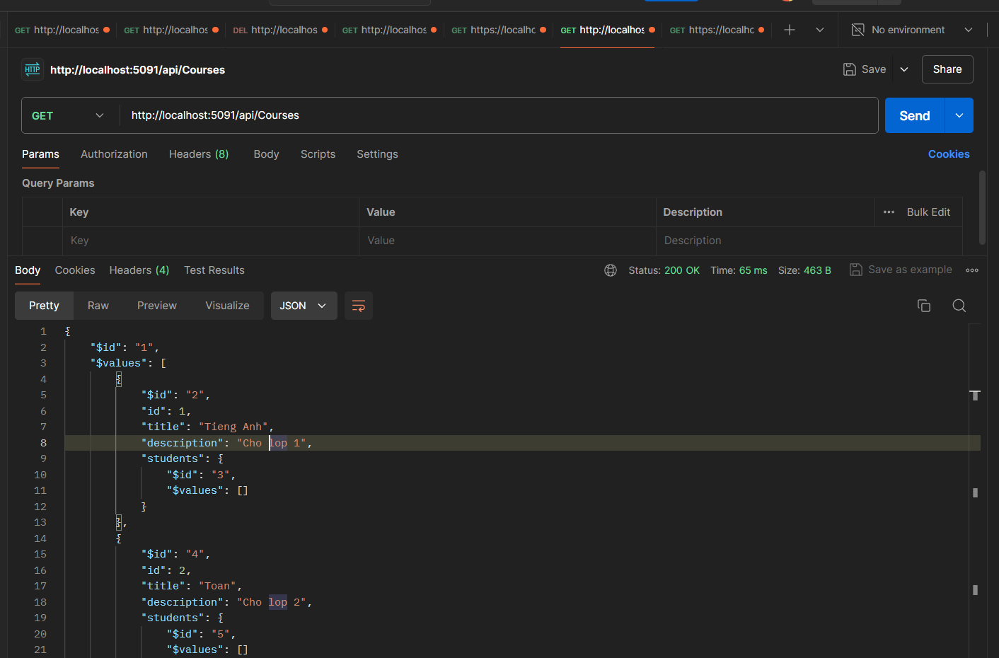
### 2 get by id
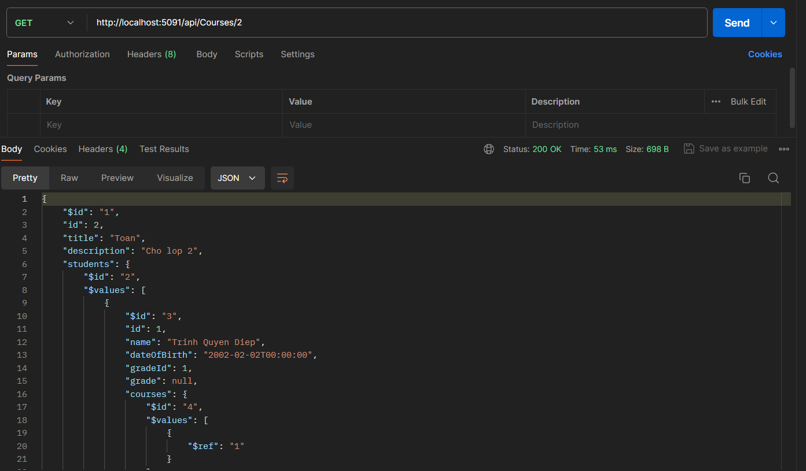
### 3 add course
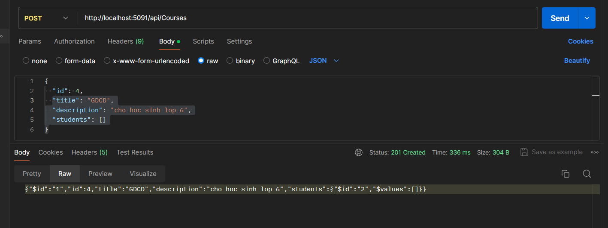
### 4 update course
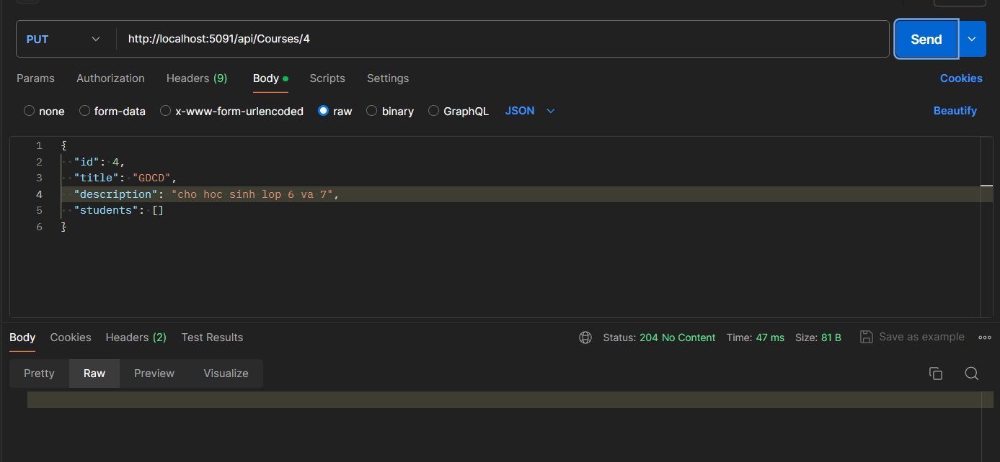
### 5 delete course
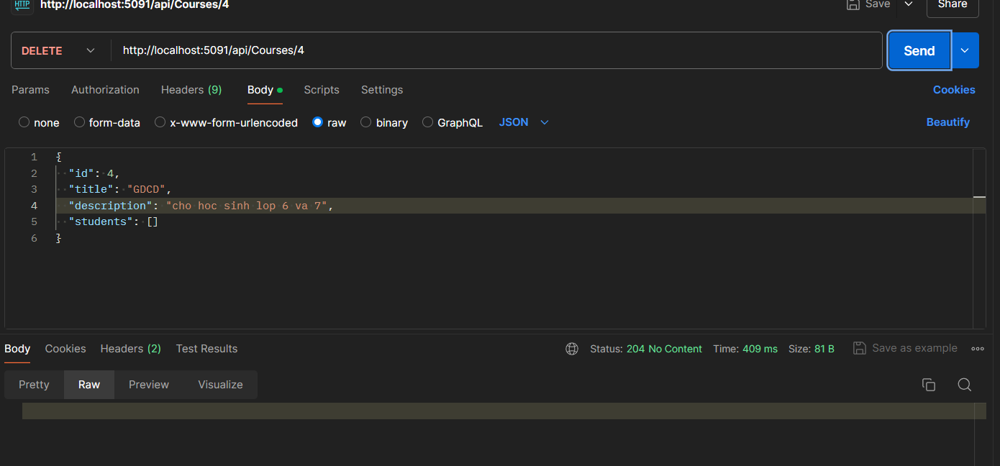
### 6 import student 
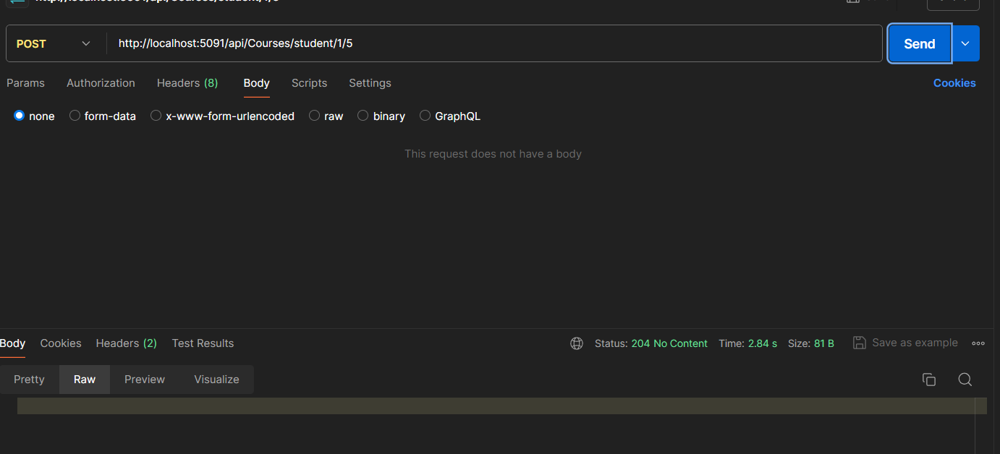
## Grade API
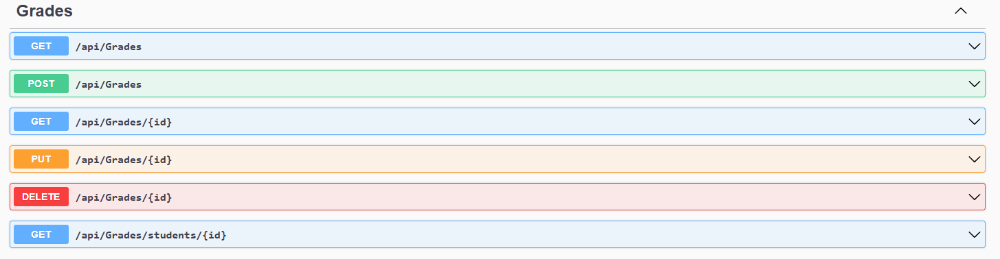
### 1 get all
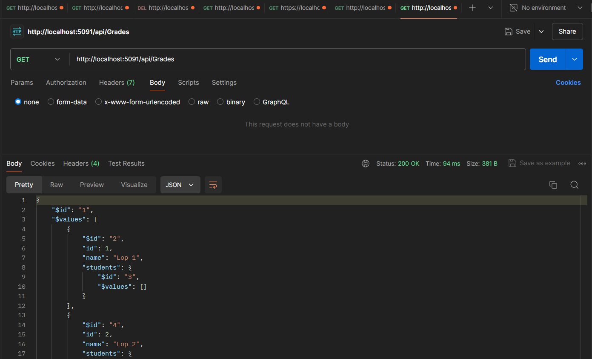
### 2 get by id
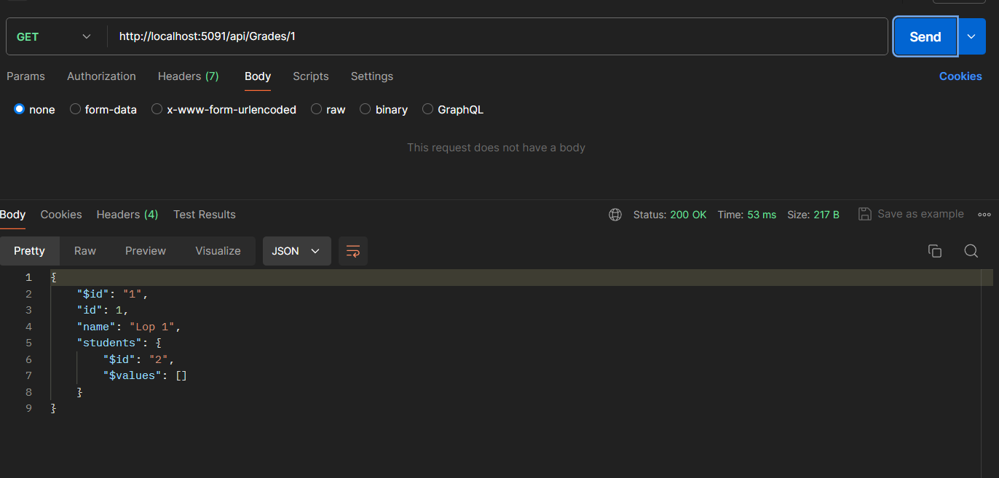
### 3 add grade
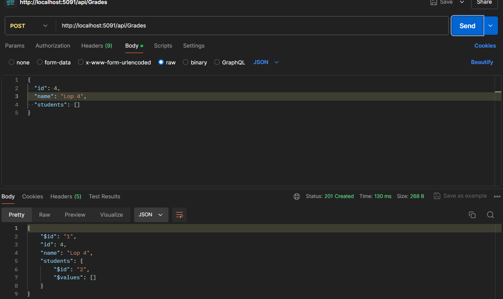
### 4 update grade
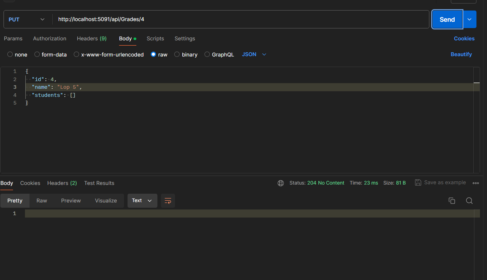
### 5 delete grade
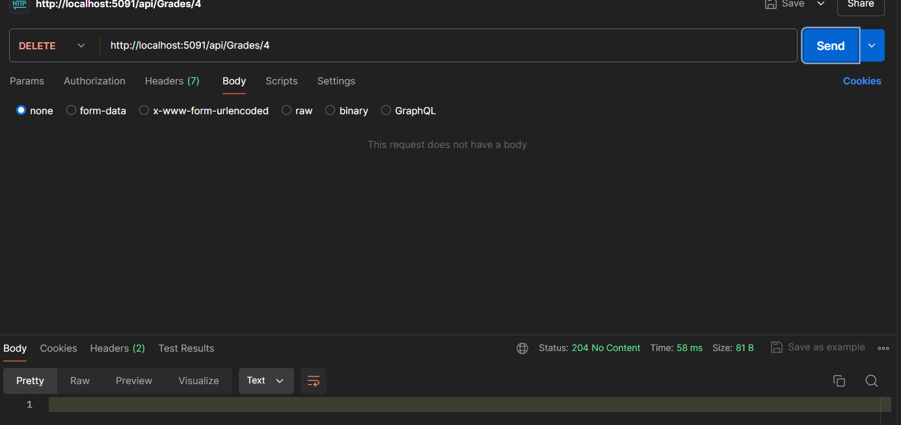
### 6 get all students in grade
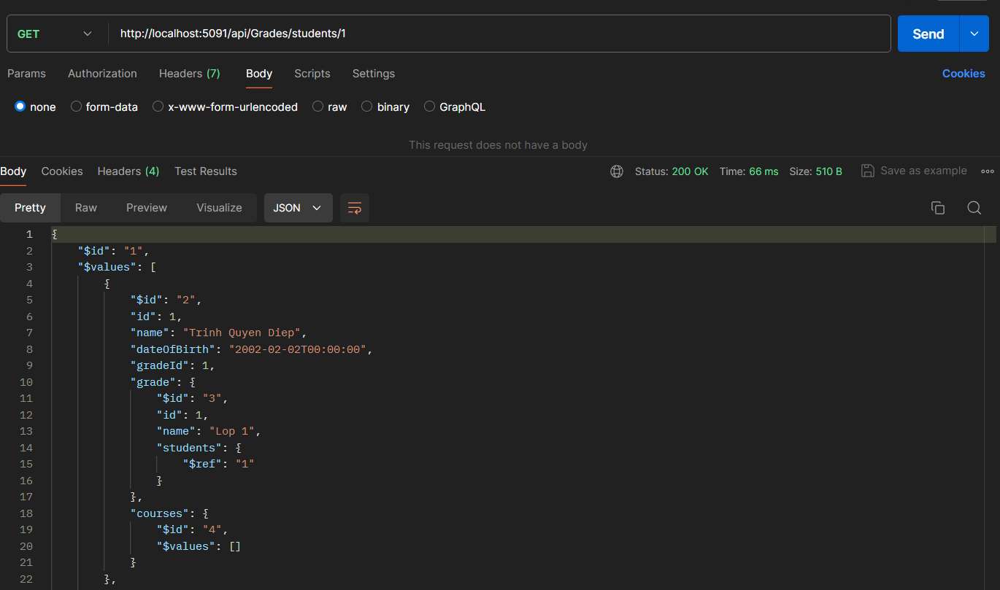
## Student API 
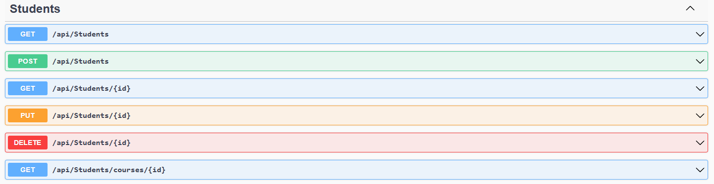
### 1 get all
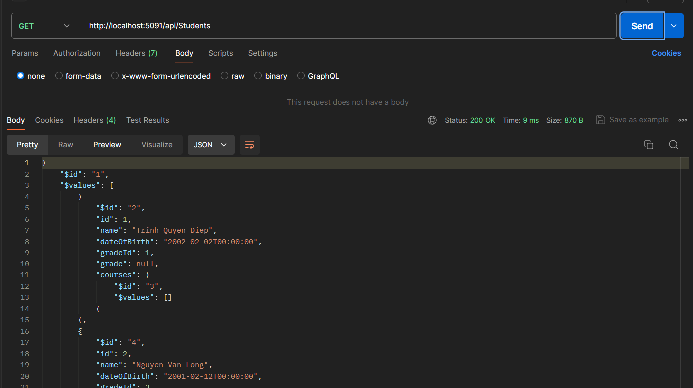
### 2 get by id
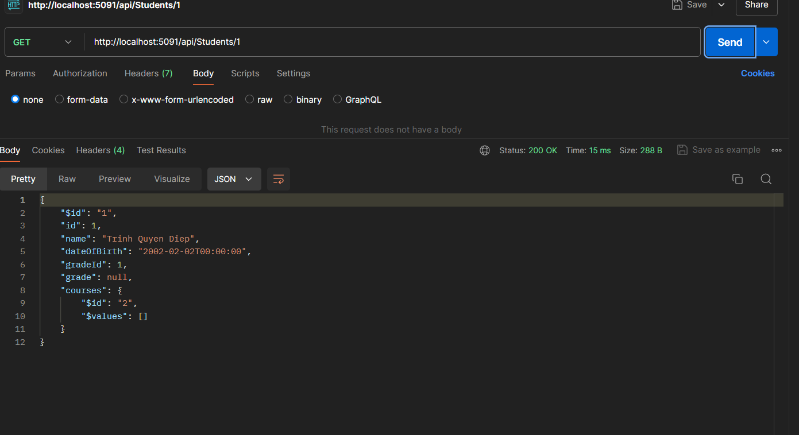
### 3 add student
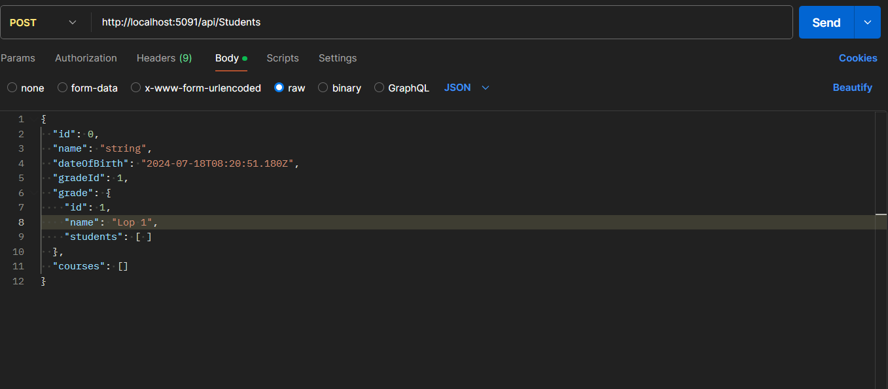
### 4 update student
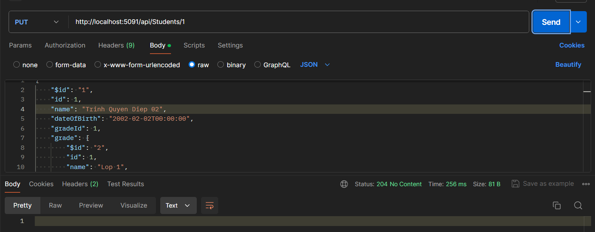
### 5 delete student
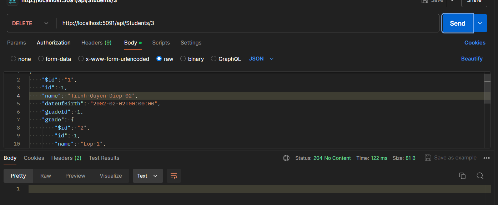
### 6 get all courses 
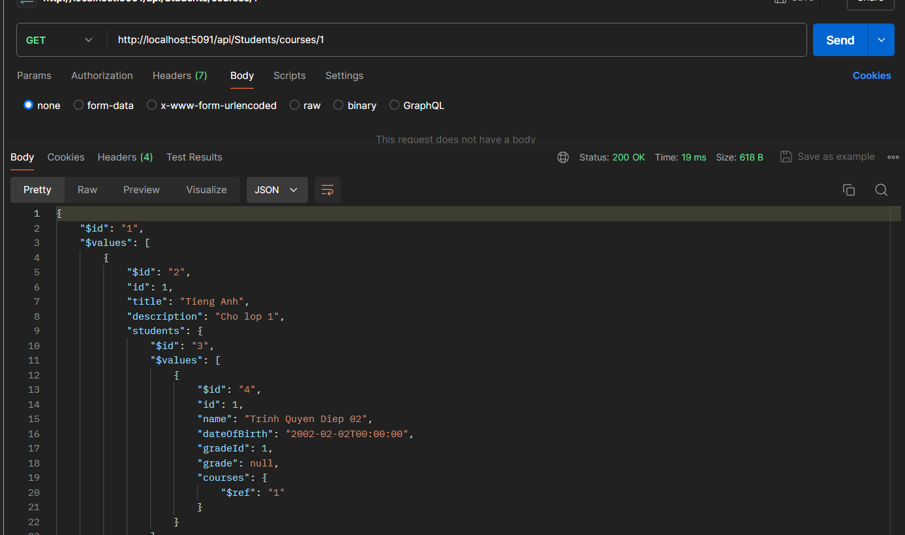